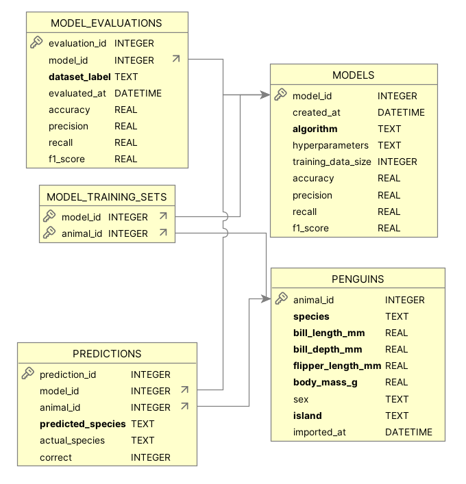

# 🐧 Penguin Species Prediction NEW DATA— MLOps Exercise

This exercise is designed to simulate an end-to-end MLOps workflow using a penguin classification task. We will work with a dataset of penguin features to build, evaluate, and monitor ML models, using SQLite as a lightweight metadata store.

---

## 📦 Project Structure

```text
penguin-mlops/
├── data/
│   └── new_data.csv                   
│
├── database/
│   └── penguins.db
│
│── images/│
│
├── models/
│   ├── first_model.pkl               
│   └── model_2.pkl                  
│
├── scripts/
│   ├── db/
│   │   ├── STEP_1_create_db.py     
│   │   ├── STEP_2_import_original_data.py
│   │   └── STEP_4_import_new_data.py
│   │    
│   ├── model/
│   │   ├── STEP_3_train_and_evaluate_original_data.py(model_id = 1)
│   │   ├── STEP_5_test_first_model_on_new_data.py
│   │   └── STEP_6_train_second_model_new_data.py(model_id = 2)
│   │
│   ├── monitoring/
│   │   └── check_imported_at_counts.py    # Shows summary of original vs new data
│
├── README.md                        
└── requirements.txt                
```


## 🧠 Learning Objectives

- Understand the lifecycle of ML models in production
- Track metadata for datasets, training, predictions, and evaluations
- Use SQLite to persist:
  - Model configurations and metrics (`MODELS`)
  - Dataset versions (`imported_at`)
  - Predictions per sample (`PREDICTIONS`)
  - Train/test splits (`MODEL_TRAINING_SETS`)
  - Evaluation results over time (`MODEL_EVALUATIONS`)




---

## ✅ Steps

1. **Create database and tables**  

scripts/db/STEP_1_create_db.py

2. **Import original data**

scripts/db/STEP_2_import_original_data.py

3. **Preprocess data**

scripts/models/STEP_3_train_and_evaluate_original_data.py

4. **Import new data**

scripts/db/STEP_4_import_new_data.py

5. **Test first model on new data**

scripts/models/STEP_5_test_first_model_on_new_data.py

6. **Train second model on new data**

scripts/models/STEP_6_train_second_model_new_data.py


